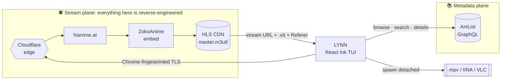
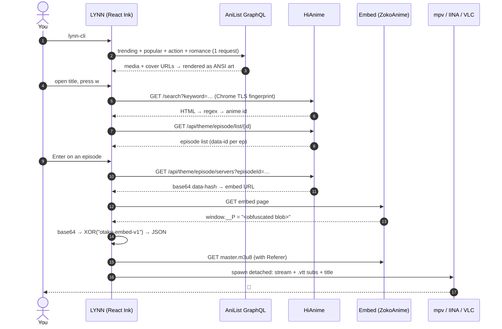
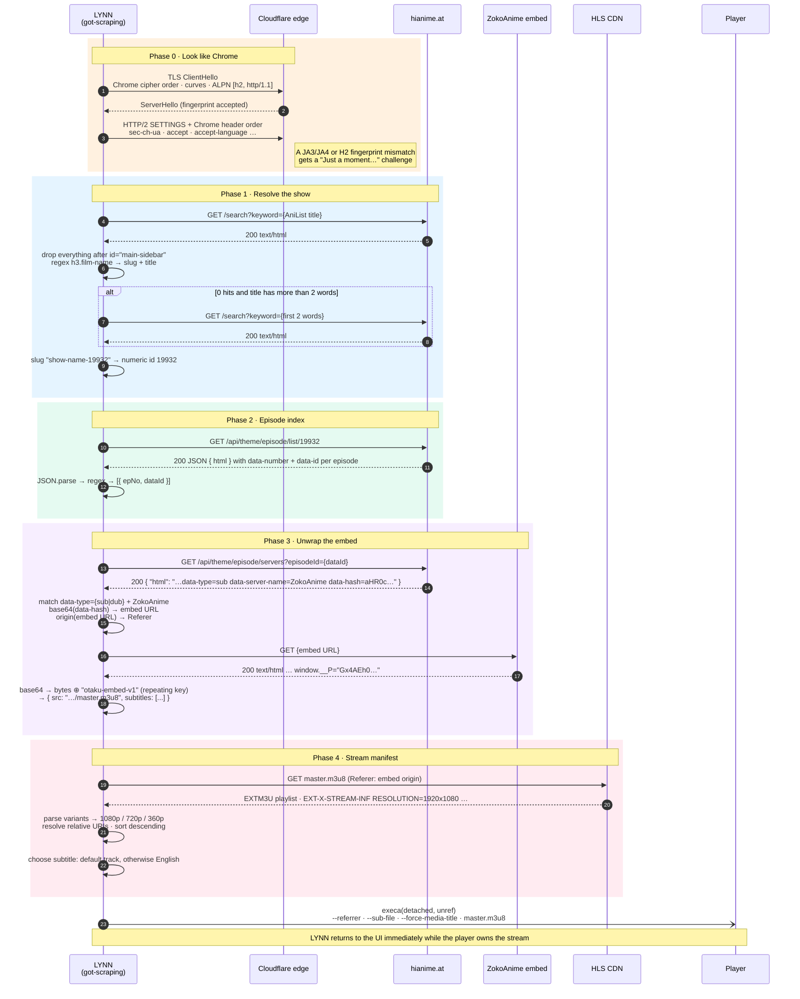
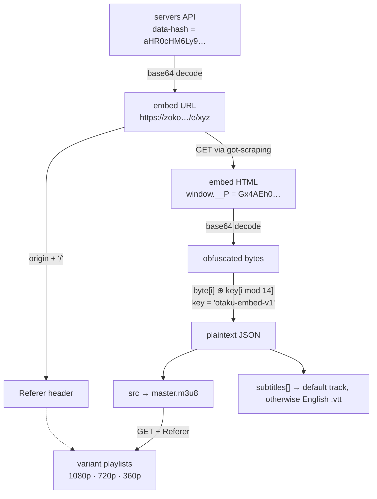
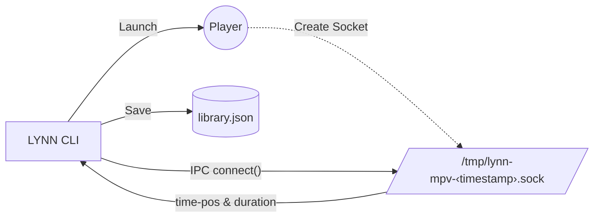
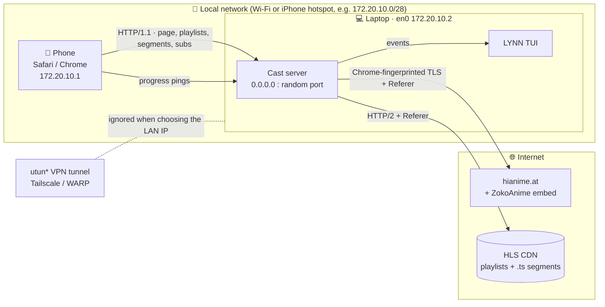
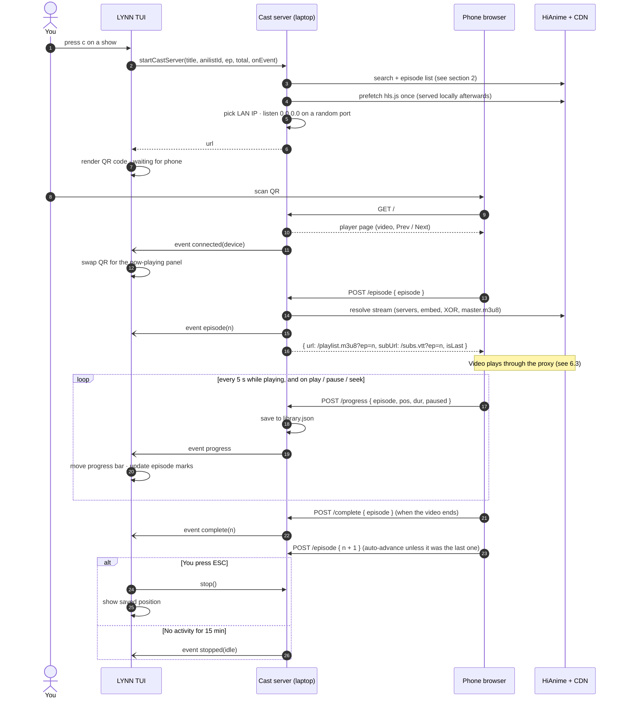
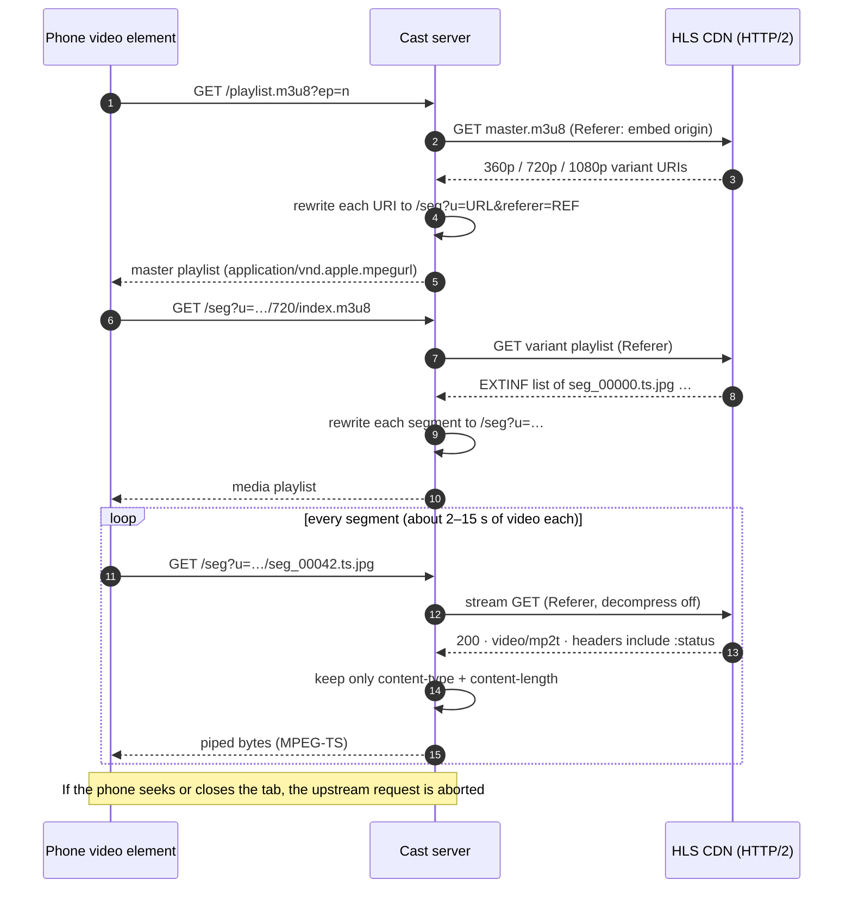
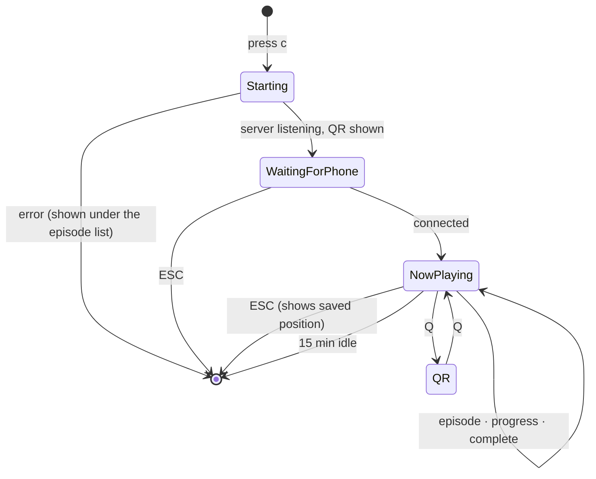

<div align="center">


# LYNN

### Local Yet No Nonsense — anime streaming, straight from your terminal.

A full-screen TUI that brings a streaming-service browsing experience to the command line:<br/>
trending rows, real cover art drawn in ANSI, rich detail pages, and one keypress to start playing in **mpv / IINA / VLC**.

[](https://www.typescriptlang.org/)
[](https://github.com/vadimdemedes/ink)
[](https://nodejs.org/)
[](#-get-started)

[**Get started**](#-get-started) · [**Features**](#-features) · [**Controls**](#%EF%B8%8F-controls) · [**How it works**](#-how-it-works) · [**Troubleshooting**](#-troubleshooting)

</div>

---

## 🚀 Get started

**1. Install two things**

- [Node.js](https://nodejs.org/) (version 22 or newer)
- A video player: [IINA](https://iina.io/) on Mac, or [mpv](https://mpv.io/installation/) / [VLC](https://www.videolan.org/) on any system

**2. Paste this into your terminal**

```bash
git clone https://github.com/LynnT-2003/lynn-cli.git
cd lynn-cli
npm install
npm run build
npm start
```

**3. Watch**

Press <kbd>s</kbd> to search, <kbd>Enter</kbd> to open a show, and <kbd>w</kbd> to watch. 🍿

<details>
<summary>Next time</summary>

<br/>

Open your terminal and run:

```bash
cd lynn-cli
npm start
```

Or run `npm link` once inside the folder. After that, `lynn-cli` starts it from any folder.

</details>

---

## ✨ Features

| | |
|---|---|
| 🎬 **Netflix-style browse screen** | Hero spotlight carousel plus horizontal rows for *Trending*, *Popular*, *Action* and *Romance*. All four rows load in a **single** AniList GraphQL round trip. |
| 🖼️ **Real cover art in the terminal** | Posters are fetched, resized with `sharp` (Lanczos3), and drawn as true-colour `▀` half-blocks, which doubles the vertical resolution. Results are cached, so scrolling back doesn't refetch them. |
| 🔎 **Instant search** | A live overlay shows the top hits as you type, and a full paginated grid opens when you want more. |
| 📖 **Rich detail pages** | Synopsis, score, studios, characters, staff, related seasons, external links and recommendations. Every one of them can be navigated. |
| 🗣️ **Sub *and* dub** | Press <kbd>m</kbd> in the episode picker to switch modes. English subtitles are attached to the player automatically. |
| 🛡️ **No `curl-impersonate`** | Requests use Chrome-like TLS fingerprints from inside Node, so there are no prebuilt C binaries or bash wrappers to install. |
| 🚀 **Plays natively** | The stream is handed to your local player as a detached process with the correct referrer, title and subtitle track. No ads and no browser. |
| 📱 **Cast to your phone** | Press <kbd>c</kbd> and scan the QR code. The episode plays in Safari or Chrome on your phone, over Wi-Fi or an iPhone hotspot, while the terminal shows what's playing. |
| 💾 **Progress Tracking** | MPV's IPC socket is monitored to automatically save your exact watch position and episode when you close the player. Jump right back in where you left off from your Profile screen! |
| 📑 **Playlists & Sharing** | Create and manage custom playlists. Export them as base64 strings and share them with friends to import using `lynn-cli import <string>`. |

---

## 📸 Tour

<table>
  <tr>
    <td width="42%" valign="top">
      
    </td>
    <td width="58%" valign="middle">
      <h3>🔎 Search the latest anime in seconds</h3>
      <p>Results appear as you type, each with its cover art, episode count and airing status. Press <kbd>Enter</kbd> to open the full paginated grid.</p>
      <p><code>AniList GraphQL · perPage 5 · debounced</code></p>
    </td>
  </tr>
</table>

### 🎬 A fully curated explore screen
A spotlight carousel sits above the *Trending*, *Popular*, *Action* and *Romance* rows. All four rows come back from one GraphQL request.


### 📖 Deep detail pages
The page shows the synopsis, score, studios, characters, staff, relations and external links, and every item can be navigated with the arrow keys.


### ▶️ Pick an episode and it streams locally
Press <kbd>w</kbd>, choose an episode and press <kbd>Enter</kbd>. LYNN resolves the stream and opens mpv or IINA with subtitles already attached.


### 💡 Recommendations (because why stop?)


### 🌀 Infinite rabbit holes
Selecting a relation or a recommendation opens its detail page, and you can keep following links from there.


---

## ⌨️ Controls

| Screen | Key | Action |
|---|---|---|
| **Splash** | <kbd>Enter</kbd> / <kbd>Space</kbd> / <kbd>s</kbd> | Continue |
| **Browse** | <kbd>←</kbd> <kbd>→</kbd> <kbd>↑</kbd> <kbd>↓</kbd> | Move between the spotlight and the rows |
| | <kbd>Enter</kbd> | Open the title |
| | <kbd>s</kbd> or <kbd>↑</kbd> from the spotlight | Search |
| | <kbd>Esc</kbd> | Quit |
| **Search** | *type* | Live results |
| | <kbd>↑</kbd> <kbd>↓</kbd> · <kbd>Enter</kbd> | Choose a result or open the full grid |
| | <kbd>Esc</kbd> | Close |
| **Profile** | <kbd>Enter</kbd> | Edit Name / Create Playlist |
| | <kbd>s</kbd> | Share focused playlist |
| | <kbd>c</kbd> | Create new playlist |
| **Detail** | <kbd>w</kbd> | Watch now |
| | <kbd>p</kbd> | Add to / Remove from Playlist |
| | <kbd>c</kbd> | Cast to your phone |
| | Arrow keys · <kbd>Enter</kbd> | Expand the synopsis, jump to a relation or recommendation, or open a link |
| | <kbd>b</kbd> / <kbd>Esc</kbd> / <kbd>Backspace</kbd> | Back |
| **Episodes** | <kbd>↑</kbd> <kbd>↓</kbd> or <kbd>j</kbd> <kbd>k</kbd> | Choose an episode |
| | <kbd>m</kbd> | Switch between sub and dub |
| | <kbd>Enter</kbd> | Resolve the stream and launch the player |
| | <kbd>Esc</kbd> | Close |
| **Casting** | <kbd>q</kbd> | Show / hide the QR code |
| | <kbd>Esc</kbd> | Stop casting |

---

## 🔄 How it works

> **Contents**
> 1. [Overview](#1-overview): [architecture](#11-architecture) · [end-to-end flow](#12-end-to-end-flow)
> 2. [HiAnime scraper](#2-hianime-scraper): [request trace](#21-request-trace) · [decoding pipeline](#22-decoding-pipeline)
> 3. [Cloudflare bypass](#3-cloudflare-bypass)
> 4. [AniList metadata](#4-anilist-metadata)
> 5. [Player handoff](#5-player-handoff)
> 6. [Cast to phone](#6-cast-to-phone): [network topology](#61-network-topology) · [session lifecycle](#62-session-lifecycle) · [HLS proxy](#63-the-hls-proxy-hot-path) · [phone ↔ terminal sync](#64-phone--terminal-sync)
> 7. [Local library & playlists](#7-local-library--playlists)

---

### 1. Overview

LYNN runs two separate pipelines:

| Plane | Source | Access | Used for |
|---|---|---|---|
| 📚 **Metadata** | AniList | Official GraphQL API | browse rows, search, details, cover art |
| 🕷️ **Stream** | HiAnime → ZokoAnime → HLS CDN | **Scraped** (no public API) | episode lists, video URL, subtitles |

LYNN links the two by title. It takes the AniList title, searches HiAnime for it, and uses the first result. If that search finds nothing and the title has more than two words, it searches again with the first two words only.

#### 1.1 Architecture



#### 1.2 End-to-end flow

This is what happens from launch to playback. Each step is covered in detail in the sections below.



---

### 2. HiAnime scraper

> **Source:** [`src/lib/hianime.ts`](src/lib/hianime.ts) · **Base URL:** `https://hianime.at` · **Transport:** `got-scraping`, 15 s timeout

HiAnime has no public API. Pressing <kbd>Enter</kbd> on an episode sets off **six sequential HTTP requests to three hosts**. The responses pass through **two layers of encoding** before the HLS stream is ready to play. No headless browser is involved and no JavaScript is executed.

#### 2.1 Request trace



#### 2.2 Decoding pipeline

The stream URL is wrapped in **two layers**. The first is base64 in the servers API. The second is base64 plus a repeating-key XOR in the embed page.



```ts
// the whole "encryption": a 14-byte repeating XOR key
function deobfuscateBlob(b64: string): string {
  const bytes = Buffer.from(b64, "base64");
  const key = Buffer.from("otaku-embed-v1");
  const out = Buffer.alloc(bytes.length);
  for (let i = 0; i < bytes.length; i++) out[i] = bytes[i]! ^ key[i % key.length]!;
  return out.toString("utf8");
}
```

---

### 3. Cloudflare bypass

Cloudflare doesn't rely on the User-Agent alone. It fingerprints the **TLS ClientHello** (the cipher suite order, extensions, supported groups and ALPN, summarised as JA3/JA4) and the **HTTP/2 connection preface** (the SETTINGS frame, pseudo-header order and header order). A client like `node-fetch` that sends a Chrome User-Agent with Node's default TLS handshake fails immediately.

| | `curl` / `fetch` | `ani-cli` | **LYNN** |
|---|:-:|:-:|:-:|
| TLS fingerprint matches a browser | ❌ | ✅ | ✅ |
| HTTP/2 SETTINGS and header order match a browser | ❌ | ✅ | ✅ |
| No native binaries to install | ✅ | ❌ (`curl-impersonate`) | ✅ |
| Process spawned per request | — | ✅ (slow) | **None (in-process)** |
| Works on Apple Silicon without extra steps | ✅ | ⚠️ | ✅ |

LYNN sends every request through [`got-scraping`](https://github.com/apify/got-scraping). It rebuilds the ClientHello and the HTTP/2 preface to match a real Chrome profile, using Node's own `tls` and `http2` modules, so nothing is forked or exec'd. A 200 response that is really a challenge page is still caught and reported as a failure, so LYNN never tries to parse it:

```ts
const { body } = await gotScraping.get(url, { headers, timeout: { request: 15000 } });
if (body.toLowerCase().includes("just a moment")) {
  throw new Error("Cloudflare blocked or request failed (HTTP 403)");
}
```

---

### 4. AniList metadata

> **Source:** [`src/lib/anilist/`](src/lib/anilist) · **Endpoint:** `POST https://graphql.anilist.co`

| Query | Used by | Notes |
|---|---|---|
| Browse rows | Browse screen | **Four aliased `Page` queries in one request:** `trending`, `popular`, `action` and `romance`, with 15 results each |
| Search | Search overlay and grid | Paginated with `page` and `perPage`, plus `hasNextPage` |
| Details | Detail screen | Characters (by role), staff, relations, recommendations and external links |

**Cover art:** each poster goes through `fetch`, then `sharp.resize(cols, rows × 2, lanczos3)`, then a 1.25× saturation boost. Each pair of vertical pixels becomes one `▀` cell, with the top pixel as the foreground colour and the bottom pixel as the background colour. Results are cached by `url × size × fit`.

---

### 5. Player handoff

> **Source:** [`src/lib/player.ts`](src/lib/player.ts)

LYNN checks for a player with `command -v`, in the order **IINA → mpv → VLC**. On macOS it also checks for `/Applications/IINA.app/…/iina-cli`. The player is then started as a **detached, unref'd** process, so LYNN's UI stays responsive.

| Player | Referer | Subtitles | Title |
|---|---|---|---|
| IINA | `--mpv-referrer=` | `--mpv-sub-files=` (`:` escaped) | `--mpv-force-media-title=` |
| mpv | `--referrer=` | `--sub-file=` | `--force-media-title=` |
| VLC | `--http-referrer=` | `:input-slave=` | `--meta-title=` |

LYNN now also features **Watch Tracking**, actively monitoring playback through Unix IPC sockets.



If the player supports IPC (`mpv` natively, or `IINA` via `--mpv-input-ipc-server`), LYNN actively streams playback events. If you watch past 90% of an episode, or stop within its last 90 seconds, it's marked as complete, and the next episode will be automatically queued up in the UI.

---

### 6. Cast to phone

> **Source:** [`src/lib/castServer.ts`](src/lib/castServer.ts) · **UI:** [`src/screens/DetailScreen.tsx`](src/screens/DetailScreen.tsx)

Press <kbd>c</kbd> on any show and scan the QR code. The episode plays in your phone's browser, with no app to install. The laptop runs a small HTTP server that stands between the phone and the video CDN. The phone never contacts HiAnime or the CDN directly; it only talks to your laptop over the local network. This works on home Wi-Fi and on an **iPhone Personal Hotspot**, in both Safari and Chrome.

#### 6.1 Network topology



**Choosing the address for the QR code:** the server lists every IPv4 interface on the laptop. It skips VPN tunnels (`utun*`, `tun*`, `ipsec*`, `bridge*`, `awdl*`, and the `100.64.0.0/10` range that Tailscale uses), because the phone can't reach those. From what's left, it prefers the iPhone hotspot subnet `172.20.10.x`, then any private range (`10.x`, `172.16–31.x`, `192.168.x`). The server listens on `0.0.0.0` on a random free port.

#### 6.2 Session lifecycle



#### 6.3 The HLS proxy (hot path)

The phone's player (AVPlayer on iOS, through the `<video>` element) only ever requests URLs on the laptop. Every playlist the server returns has its URI lines rewritten to point back at `/seg`, so all requests keep going through the proxy.



**Why the phone can't fetch the CDN itself**

| Problem | What the proxy does |
|---|---|
| The CDN rejects requests that don't carry the embed's `Referer`, and a browser `<video>` element can't set one | The server adds `Referer` to every upstream request |
| Segments are disguised as images (`seg_00000.ts.jpg`) | They're passed through as raw bytes with the CDN's `video/mp2t` type, and `video/mp2t` is used if none is given |
| The CDN answers over **HTTP/2**, so its headers include pseudo-headers like `:status`, which Node's HTTP/1 `writeHead` rejects with `ERR_INVALID_HTTP_TOKEN` | Only `content-type` and `content-length` are forwarded, and with `decompress: false` the length always matches the bytes |
| HiAnime and the CDN are behind Cloudflare | The server uses the same Chrome-fingerprinted `got-scraping` client as the scraper (section 3) |
| Chrome needs `hls.js`, and a hotspot connection may be slow or offline | `hls.js` is downloaded once when casting starts and served from `/hls.js`. iOS plays HLS natively anyway |
| Relative URIs inside playlists | Rebased onto the upstream playlist's directory before rewriting |

#### 6.4 Phone ↔ terminal sync

The server reports what the phone is doing through an `onEvent` callback. The terminal then shows the same kind of status panel as local playback, instead of leaving a QR code on screen.



| Phone does | Route | Event | Terminal shows |
|---|---|---|---|
| Opens the page | `GET /` | `connected` | QR replaced by **📱 CASTING TO ‹device›** |
| Picks or auto-advances an episode | `POST /episode` | `episode` | Episode number, ◌ loading, episode list cursor moves |
| Plays, pauses or seeks | `POST /progress` | `progress` | ▶ / ❚❚, progress bar and `mm:ss / mm:ss`, which keeps advancing between pings while playing |
| Finishes an episode | `POST /complete` | `complete` | ✓ mark in the episode list, "ep N completed on phone" |
| Nothing for 15 min | — | `stopped` | Panel closes, "cast ended after 15 min idle" |

Progress is saved to the same library as local playback, so you can start an episode on your phone and finish it in mpv on the laptop.

---

### 7. Local library & playlists

> **Source:** [`src/db/`](src/db)

Progress, watch history, your profile and playlists are kept in a single JSON file at `~/.local/share/lynn-cli/library.json` (or under `$XDG_DATA_HOME` if it's set). Writes go to a temporary file first and are then renamed into place, so a crash never leaves a half-written library. Local playback and casting both save to this same file.

Playlists can be shared as a `lynn:playlist:…` base64 string and imported with `lynn-cli import <string>`.

---

## 🩺 Troubleshooting

| Symptom | Fix |
|---|---|
| `No player found (mpv, vlc, iina)` | Install a player and make sure `which mpv` (or `which iina` / `which vlc`) prints a path. On macOS, LYNN also checks `/Applications/IINA.app`. |
| `Cloudflare blocked or request failed (HTTP 403)` | Cloudflare tightened its rules or your IP was flagged. Wait a little, change networks, or run `npm update got-scraping`. |
| `No ZokoAnime server found for mode dub` | That episode has no dub. Press <kbd>m</kbd> to switch back to sub. |
| Wrong show plays | The AniList → HiAnime title match picked a near-duplicate, which happens most often with sequels and specials. Please open an issue with the title. |
| Cover art looks blocky or broken | Use a terminal with true-colour support (iTerm2, WezTerm, Kitty, Windows Terminal, Ghostty), and make the window bigger. |
| Phone can't open the cast link | Make sure the phone and laptop are on the same Wi-Fi, or the laptop is joined to the phone's hotspot. If a VPN with an exit node is on (Tailscale, WARP), allow **local network access** in its settings. |
| Cast page loads in Safari but not in Chrome (iOS) | iPhone Settings → Chrome → turn on **Local Network**. |
| Cast page loads but the video never starts | Update to the latest version. Older builds forwarded HTTP/2 headers and sent empty video segments. |
| `Cannot find module dist/cli.js` | Run `npm run build` first, then `npm start`. |

---

## 🙏 Credits

- [`ani-cli`](https://github.com/pystardust/ani-cli), the original inspiration
- [AniList](https://anilist.co/) for its free and excellent GraphQL API
- [Ink](https://github.com/vadimdemedes/ink), [got-scraping](https://github.com/apify/got-scraping), [sharp](https://sharp.pixelplumbing.com/)

## ⚠️ Disclaimer

LYNN does not host, store or distribute any media. It is a client that reads publicly reachable third-party pages, in the same way a browser does. You are responsible for following the laws of your jurisdiction and the terms of the sites you access. This project is for educational purposes.

<div align="center"><sub>Built with ☕ and too many episodes.</sub></div>
