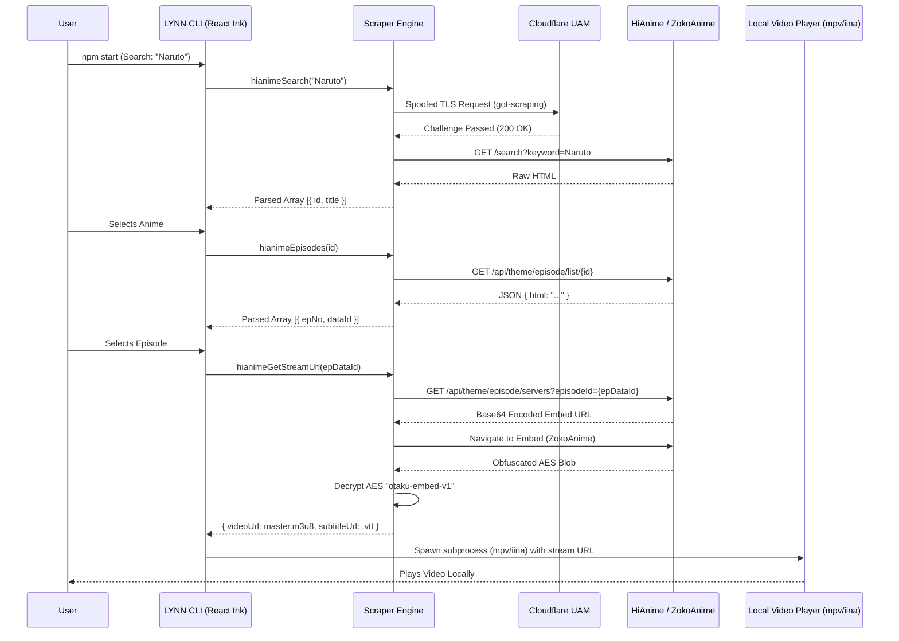

<div align="center">

```text
  _        __     __  _   _   _   _ 
 | |       \ \   / / | \ | | | \ | |
 | |        \ \_/ /  |  \| | |  \| |
 | |         \   /   | . ` | | . ` |
 | |____      | |    | |\  | | |\  |
 |______|     |_|    |_| \_| |_| \_|
```

**Local Yet No Nonsense.**  
*v0.1.0 · EST. 2026*

<p align="center">
  <br>
  <b>Privacy-first streaming from your terminal.</b><br>
  No ads, no accounts, no login. no tracking.<br>
  <br>
  <code>Just anime. All Yours.</code>
</p>
</div>

---

## 📖 Table of Contents
- [About](#about)
- [How It Works (Architecture Flow)](#how-it-works-architecture-flow)
- [Cloudflare UAM Bypass (The Hard Part)](#cloudflare-uam-bypass-the-hard-part)
- [Scraping Mechanics](#scraping-mechanics)
- [Installation & Usage](#installation--usage)

---

## ⚡ About

**LYNN (Local Yet No Nonsense)** is a highly optimized, TypeScript-based CLI application that allows you to stream anime directly from your terminal. It serves as a modern, cross-platform spiritual successor to `ani-cli`. 

LYNN bypasses aggressive Cloudflare Under-Attack Mode (UAM) protections natively, meaning it streams seamlessly on macOS, Linux, and Windows without relying on fragile external bash scripts or manually compiled C++ binaries.

---

## 🔄 How It Works (Architecture Flow)

LYNN operates entirely locally on your machine. When you search for a show, it orchestrates a complex sequence of scrapes, API calls, and video decryption streams to deliver the final `.m3u8` directly to your local video player.



---

## 🛡️ Cloudflare UAM Bypass (The Hard Part)

Anime streaming sites (like HiAnime) sit behind aggressive Cloudflare protections. When they are under DDOS attacks, they enable **Under-Attack Mode (UAM)**, which blocks standard HTTP clients (`curl`, `node-fetch`, `axios`) by analyzing their TLS fingerprint.

### How `ani-cli` solved this:
`ani-cli` solves this by forcing users to download custom-compiled C++ binaries of `curl` (`curl-impersonate`) that hardcode the TLS fingerprint of Google Chrome. However, this regularly breaks on M-Series Macs and requires maintaining arbitrary bash wrappers.

### How LYNN solves this:
LYNN natively bypasses UAM in Node.js using `got-scraping`. 
Instead of spawning a slow subprocess for every HTTP call, we manipulate Node.js's internal TLS and HTTP/2 stack to perfectly spoof the cryptographic fingerprint of Chrome 124.

**The Mechanics:**
1. **Cipher Suites:** We send a highly specific sequence of ECDHE and AES-GCM ciphers to match Chrome.
2. **ALPN & Curves:** We force ALPN negotiation to prioritize HTTP/2 (`h2`) and spoof Chrome's specific elliptic curves.
3. **Header Ordering:** Browsers send headers in a very specific, hardcoded order. Standard HTTP clients shuffle them. We force rigid header ordering.

```typescript
// Natively bypass Cloudflare UAM without subprocess overhead
const { body } = await gotScraping.get(url, { 
    headers: {
        "User-Agent": "Mozilla/5.0 (Windows NT 10.0; Win64; x64)...",
    }, 
    timeout: { request: 15000 } 
});
```
*Result: Cloudflare sees our CLI as a standard Google Chrome browser, completely bypassing the UAM block.*

---

## 🕷️ Scraping Mechanics

LYNN uses custom-built, resilient scrapers for its data sources.

### 1. HiAnime (Primary Source)
- **Search & Episodes:** We perform raw HTTP GET requests to `hianime.at` and parse the raw HTML using precise Regex patterns to extract the `data-id` for episodes.
- **Video Extraction:** 
  - We fetch the `servers` endpoint to extract a Base64-encoded URL pointing to the video embed (ZokoAnime).
  - We scrape the embed page and locate the `window.__P` variable, which contains an obfuscated JSON blob.
  - We run a custom AES-style XOR decryption algorithm using the key `otaku-embed-v1` to decode the blob.
  - The decrypted JSON yields the raw `.m3u8` master playlist and English `.vtt` subtitles.

### 2. AllAnime (Fallback Source)
- **Search & Episodes:** We interface directly with AllAnime's hidden GraphQL API (`api.allanime.day/api`). 
- **Bypass:** Because Node 18+ natively supports global `fetch()`, we bypass the need for external fetch libraries to query the GraphQL edges.

---

## 🚀 Installation & Usage

1. **Clone the repository:**
   ```bash
   git clone https://github.com/LynnT-2003/lynn-cli.git
   cd lynn-cli
   ```
2. **Install dependencies:**
   ```bash
   npm install
   ```
3. **Run the CLI:**
   ```bash
   npm start
   ```

*Enjoy uninterrupted, ad-free streaming right from your terminal.*
